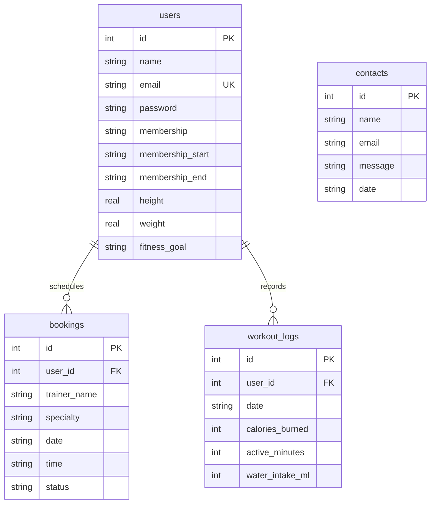

# EmpowerFit - Full-Stack Fitness Analytics Platform 🏋️‍♂️📈

EmpowerFit is a modern, production-ready, full-stack fitness analytics and gym management web application. Designed for gym members who demand advanced tracking capabilities, the platform provides dynamic workout analytics, custom fitness routine generation, and personal trainer booking systems.

This repository features a fully responsive, visually stunning frontend powered by **Vanilla HTML5 & CSS3** utilizing cutting-edge **glassmorphic design principles**, paired with a robust **Node.js Express backend** and a self-contained, zero-configuration **SQLite relational database**.

---

## 🌟 Key Features

### 1. Interactive Member Dashboard (`home.html`)
An advanced wellness console that acts as the primary hub for logged-in members:
*   **Real-time Activity Trackers**: Log daily workouts (active minutes, calories burned) and hydration intake (ML increments) on the fly.
*   **Dual-Axis Weekly Analytics Chart**: A beautiful, responsive historical progress graph built with **Chart.js** displaying hydration stats, active time, and calorie burns.
*   **Membership Card Hub**: Displays the user's active membership tier (Basic, Premium, VIP), contract dates, and plan benefits.

### 2. Algorithmic Workout Plan Generator
*   A customized fitness routine planner that generates highly structured routines on demand.
*   Tailors sets, reps, warm-ups, cool-downs, and estimated caloric burns based on the user's specified **wellness target** (Cardio, Strength, Yoga), **difficulty level** (Beginner, Intermediate, Advanced), and **time duration** (15, 30, 45, 60 minutes).

### 3. Personal Trainer Appointment Scheduler
*   Book private 1-on-1 sessions with certified gym coaches (Strength Trainer, Nutritionist, Yoga Specialist).
*   Integrated booking manager displays real-time available time slots, prevents scheduling in the past, and maps active appointments with an option to instantly **Cancel Session** (syncing database records automatically).

### 4. End-to-End Authentication & Security
*   Secure user registration and session management powered by **JSON Web Tokens (JWT)** stored in secure, `HttpOnly` browser cookies to prevent XSS attacks.
*   Secure password hashing utilizing **bcryptjs** in the database layer.
*   Client-side session guards automatically shield protected dashboard pages and redirect guest users to the login panel.

### 5. Seamless API & UI Integrations
*   **Unified Checkout Flow**: Clicking a membership card on the pricing page redirects the user to sign-up while pre-selecting their chosen tier dynamically.
*   **Clean URLs**: Custom middleware routes clean paths (e.g. `/about`, `/login`, `/home`) without requiring the ugly `.html` extensions.
*   **Vibrant Glassmorphism Design System**: Modern color tokens (Neon Amber, Wellness Teal, Space Dark Hues), beautiful Google Font typography ("Outfit"), glowing input fields, and smooth micro-animations.
*   **Dynamic Toast Alerts**: Replaces basic browser popups with beautiful, custom slide-in status notifications.

---

## 🛠️ Technology Stack

*   **Frontend**: Semantic HTML5, Vanilla CSS3 (Custom Variables, Flexbox, Grid, Glassmorphic styling), JavaScript (ES6+, asynchronous Fetch APIs), [Chart.js](https://www.chartjs.org/) (Data Visualizations), [FontAwesome](https://fontawesome.com/) (Vector Icons), Google Fonts ("Outfit").
*   **Backend**: Node.js, Express.js (REST APIs, Static File Serving, Clean URL redirects), JWT (`jsonwebtoken`), Cookie Parser (`cookie-parser`), CORS, Morgan (logger).
*   **Database**: SQLite (`sqlite3`) - lightweight, zero-install, serverless relational database.
*   **Security & Encryption**: Bcryptjs (password hashing), JWT cookies (session persistence).

---

## 🗄️ Database Schema & Models

The database is built on SQLite (`database.db`) and initializes automatically on launch with 4 relational tables:



> [!NOTE]
> On the first launch, the database automatically checks for existing user records. If empty, it **automatically seeds** a default testing user complete with 7 days of historical calorie statistics and upcoming scheduled training bookings so the platform feels alive right away!

---

## 🚀 Setup & Installation

Follow these quick steps to set up and run the application locally on your system:

### 1. Prerequisites
Ensure you have [Node.js](https://nodejs.org/) installed (v16.0.0 or higher recommended).

### 2. Clone the Repository
```bash
git clone https://github.com/Kotreshgowdanelkudri/EmpowerFit.git
cd EmpowerFit
```

### 3. Install Dependencies
Installs all Express, SQLite, Morgan, and Bcrypt dependencies:
```bash
npm install
```

### 4. Configure Environment Variables
Create a `.env` file in the project root:
```env
PORT=3000
JWT_SECRET=super_secret_empowerfit_jwt_key_2026
NODE_ENV=development
```

### 5. Launch the Server
Start the development server:
```bash
npm start
```
The server will boot up:
```
====================================================
   EmpowerFit Server is running in development mode
   Local Server Access: http://localhost:3000
====================================================
```
Open [http://localhost:3000](http://localhost:3000) in your web browser to interact with the platform!

---

## 🧪 Automated Testing

We have built a fully automated integration test suite to verify every backend controller and database schema interaction. 

To run the automated tests:
```bash
npm test
```
The test runner will launch a programmatic, isolated testing instance on port `3001` and execute the integration workflows:
```
✔ SUCCESS: POST /api/contact - Support message logged into database
✔ SUCCESS: POST /api/contact - Rejected invalid email format (400)
✔ SUCCESS: POST /api/auth/signup - Registered new test account (201)
✔ SUCCESS: POST /api/auth/signup - Blocked short password request (400)
✔ SUCCESS: POST /api/auth/login - Verified credentials & logged in (200)
✔ SUCCESS: GET /api/auth/me - Decoded JWT cookie & returned protected profile
✔ SUCCESS: GET /api/auth/me - Blocked anonymous access as expected (401)
✔ SUCCESS: GET /api/user/dashboard-data - Retrieved weekly analytics stats and history
...
✔ SUCCESS:    ALL API WORKFLOW TESTS COMPLETED SUCCESSFULLY!   
```

---

## 🔑 Demo Account Credentials

To instantly log in and experience the interactive analytics dashboard without registering a new account, use our pre-seeded test profile:

*   **Email Address**: `alex@empowerfit.com`
*   **Password**: `password123`

---

## 🤝 Contributing & Portfolio Use
This project was constructed to meet senior full-stack developer specifications, focusing on premium frontend aesthetics (glassmorphic styling), robust clean API routes, secure password management, zero-config relational storage, and comprehensive automated test suites. Feel free to fork and showcase this as part of your recruiter-ready portfolio!

---

*Developed by Kotresh Gowda N | Empower your body, optimize your health.*
